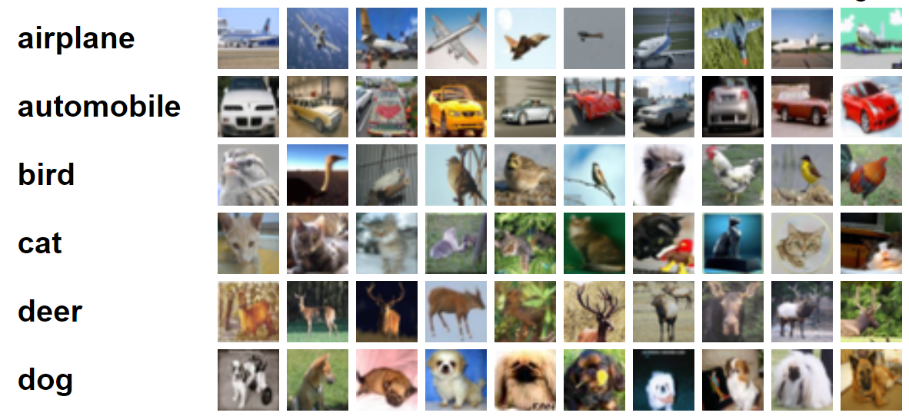
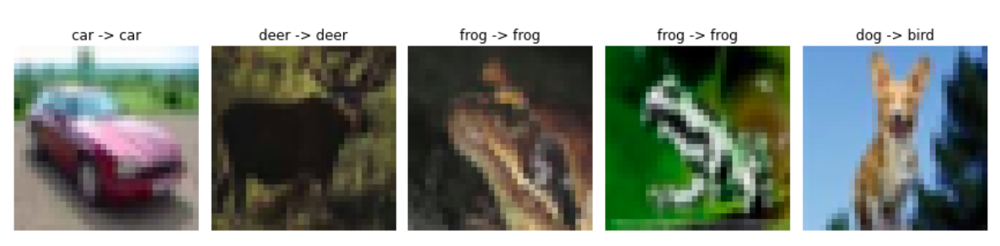

# CIFAR10-LeNet-Classifier
A classifier for the CIFAR10 dataset constructed using the historical LeNet.
 * 

## Requirements
- GPU access (Google Colab and Kaggle are good starting points for free GPU access)

## Pipeline

#### 1. Load train and test sets from the Pytorch CIFAR10 dataset
  * Check data type and normalize image intensity range
  *  
    
#### 2. Display one random sample of each class from the trainset and testset and its histogram
  * The histogram displays abundance of intensity values across a sample's three channels (R,G,B)
  *  

#### 3. Split the train set into new train and validation sets
  * For simplicity, we will just use the train set (50,000 samples) for both training and validation of this model. We randomly take 10,000 samples from the train set to be used for validation, equal to the number of test set samples.
  *  

#### 4. Construct the LeNet model
  * 
  * **Architecture hyper-parameters:**
  * Number of layers: 4 (two convolutional layers, two fully connected layers)
  * Number of kernels in conv layer 1: 6
  * Number of kernels in conv layer 2: 16
  * There are no kernels in the 2 fully connected layers.
  * Size of kernel in conv layer 1: 5x5
  * Size of kernel in conv layer 2: 5x5
  * Stride = 1
  * Zero-padding = 0

#### 5. Create an instance of ADAM optimizer and an instance of Mean Squared Error (MSE) loss function
  * The ADAM optimizer has an initial learning rate of 0.0001

#### 6. Train the model for 50 epochs
  * 

#### 7. Display the learning curve and identify the best epoch
  * The learning curve shows the model's loss and accuracy at the end of each epoch for all epochs. The criteria for the best epoch may be the minimum loss, maximum accuracy, or other criteria.
  * 

#### 8. Load the model's weights at the best epoch and test the model performance on the test set
  * We can use a confusion matrix and classifcation report to visualize and summarize the model's overall performance.
  * 
  * 

#### 9. Display model prediction for five random samples
  * 

## Output:
  * As we've seen, this very basic neural network is able to provide label predictions to the CIFAR10 dataset with 63% accuracy. This model is a great introduction to the use of Deep Learning, for image analysis and beyond. 

## Acknowledgements
* Heffner Biomedical Imaging Laboratory, Biomedical Engineering Department, School of Engineering and Applied Science, Columbia University, New York, NY
